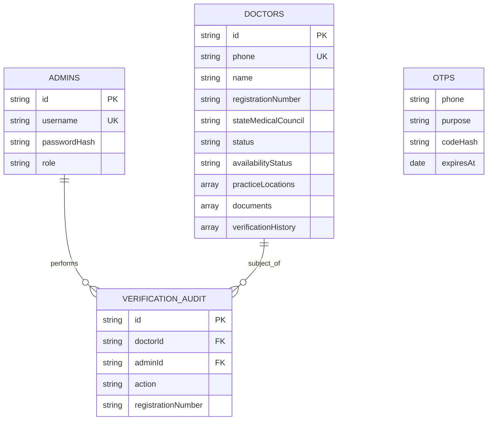

# Find Near Doctor — API & Database Plan

Technical plan for moving from mock data to a real MongoDB + API backend.  
Aligned with [plan.md](./plan.md) (product) and [tech-stack.md](./tech-stack.md) (stack).

**Dev database:** `find-near-doctor-dev` on MongoDB Atlas  
**Production database (future):** `find-near-doctor-prod` (separate cluster or DB name)

---

## 1. Architecture overview

```
┌─────────────────────────────────────────────────────────────────────────┐
│                         Next.js PWA (apps/web)                         │
│  Patient search │ Doctor onboarding │ Admin verification │ Dashboard   │
└───────────────────────────────┬─────────────────────────────────────────┘
                                │
                    Route Handlers (/app/api/*)
                                │
        ┌───────────────────────┼───────────────────────┐
        ▼                       ▼                       ▼
┌───────────────┐     ┌─────────────────┐     ┌─────────────────┐
│ MongoDB Atlas │     │   Cloudinary    │     │     MSG91       │
│  (metadata)   │     │ (files/photos)  │     │  (SMS OTP)      │
│               │     │                 │     │                 │
│ doctors       │     │ JPG PNG PDF     │     │ OTP + status    │
│ admins        │     │ presigned upload│     │ notifications   │
│ otps          │     └─────────────────┘     └─────────────────┘
│ verification_ │
│ audit         │
└───────────────┘
```

**Principle:** MongoDB stores **documents (JSON) and file URLs only**. Never store binary files in MongoDB.

---

## 2. Entity Relationship Diagram (ERD)



### Relationships

| From | To | Relationship | Notes |
|------|-----|--------------|-------|
| `doctors` | `verification_audit` | 1 : many | Every approve/reject creates an audit row |
| `admins` | `verification_audit` | 1 : many | `adminId` references `admins.id` |
| `doctors` | `documents[]` | embedded | File URLs point to Cloudinary |
| `doctors` | `verificationHistory[]` | embedded | Lightweight timeline on doctor doc |
| `otps` | — | standalone | Ephemeral; TTL auto-delete after 10 min |

---

## 3. MongoDB collections

### 3.1 Summary

| Collection | Purpose | TTL | Implemented |
|------------|---------|-----|-------------|
| `doctors` | Doctor profiles, locations, document URLs, status | — | Yes |
| `admins` | Admin users (username + bcrypt password) | — | Yes |
| `otps` | Phone OTP codes for doctor auth | 10 min | Yes |
| `verification_audit` | WBMC screenshots, approve/reject audit | — | Yes |

**Code:** `apps/web/lib/db/collections.ts`

---

### 3.2 `doctors`

Primary entity. One document per doctor account.

```typescript
{
  // Identity
  id: string,                          // "dr-001" or "dr-{timestamp}" — UNIQUE
  phone: string,                       // verified at signup — UNIQUE (sparse)
  name: string,
  photoUrl: string,                    // mandatory; also in documents[]
  registrationNumber: string,          // e.g. "WBMC-2008-14523"
  stateMedicalCouncil: string,         // e.g. "WBMC"
  specialization: string,
  yearsOfExperience: number,

  // Lifecycle
  status: "pending" | "verified" | "rejected" | "suspended",
  availabilityStatus: "available" | "busy" | "delayed" | "on_leave",
  availabilityNote?: string,
  rejectionReason?: string,
  verifiedAt?: string,                 // ISO date when approved

  // Practice
  practiceLocations: [{
    name: string,
    address: string,
    locality: string,
    pincode: string,
    state: string,
    lat: number,
    lng: number,
    consultationType: "in_person" | "online" | "both",
    schedule: [{ days: string[], startTime: string, endTime: string }],
    imageUrl?: string                  // clinic cover photo URL
  }],

  // Public profile controls
  visibility: {
    showPhone: boolean,
    showFee: boolean,
    showExactAddress: boolean,
    showBio: boolean,
    showLanguages: boolean,
    showAvailabilityNote: boolean
  },
  consultationFee?: number,
  bio?: string,
  languages?: string[],
  qualifications?: string[],

  // Uploaded files (URLs only — stored in Cloudinary)
  documents: [{
    type: "photo" | "registration_cert" | "degree" | "govt_id" | "selfie" | "clinic_cover",
    url: string,
    fileName?: string,
    mimeType?: string,
    uploadedAt: string
  }],

  // Inline verification timeline
  verificationHistory: [{
    action: "submitted" | "approved" | "rejected" | "resubmitted" | "note",
    by?: string,                       // admin id
    note?: string,
    screenshotUrl?: string,
    at: string
  }],

  // Legal consents at signup
  consents?: {
    termsAccepted: boolean,
    dataSharingAccepted: boolean,
    verificationAccepted: boolean,
    acceptedAt: string
  },

  createdAt: string,
  updatedAt: string
}
```

**Indexes**

| Index | Type | Purpose |
|-------|------|---------|
| `{ id: 1 }` | unique | Primary lookup |
| `{ phone: 1 }` | unique, sparse | One account per phone |
| `{ status: 1 }` | — | Admin queue filter |
| `{ registrationNumber: 1, stateMedicalCouncil: 1 }` | unique | Prevent duplicate registrations |

**Status flow**

```
pending ──approve──► verified ──suspend──► suspended
   │                      │
   └──reject──► rejected ──resubmit──► pending
```

---

### 3.3 `admins`

Ops team login for verification dashboard.

```typescript
{
  id: string,                          // "admin-001"
  username: string,                    // UNIQUE
  passwordHash: string,                // bcrypt, cost 12
  name: string,
  role: "admin" | "superadmin",
  createdAt: string,
  lastLoginAt?: string
}
```

**Indexes:** `{ username: 1 }` unique

**Seed:** `npm run db:seed-admin` (reads `ADMIN_USERNAME`, `ADMIN_PASSWORD` from env)

---

### 3.4 `otps`

Ephemeral OTP records for doctor phone verification.

```typescript
{
  phone: string,                       // e.g. "+919876543210"
  codeHash: string,                    // bcrypt hash of 6-digit code
  purpose: "doctor_login" | "doctor_signup",
  attempts: number,                    // max 5 before lockout
  createdAt: Date,
  expiresAt: Date                      // TTL index — auto-delete
}
```

**Indexes**

| Index | Type | Purpose |
|-------|------|---------|
| `{ expiresAt: 1 }` | TTL (`expireAfterSeconds: 0`) | Auto-delete expired OTPs |
| `{ phone: 1, purpose: 1 }` | — | Lookup on verify |

**Dev mode:** `SMS_DEV_MODE=true` → OTP is always `123456`, logged to console.

---

### 3.5 `verification_audit`

Separate audit trail for compliance (WBMC screenshots, admin actions).

```typescript
{
  id: string,                          // "audit-{timestamp}"
  doctorId: string,                    // FK → doctors.id
  adminId: string,                     // FK → admins.id
  action: "approved" | "rejected" | "note",
  registrationNumber: string,          // snapshot at time of action
  note?: string,
  rejectionReason?: string,
  wmbcScreenshotUrl?: string,          // Cloudinary URL
  createdAt: string
}
```

**Indexes:** `{ doctorId: 1, createdAt: -1 }`

---

### 3.6 `analytics_events` · `analytics_daily`

Public patient traffic (not `/admin` or `/doctor`). Full spec: [analytics.md](./analytics.md).

```typescript
// analytics_events — raw events, TTL 90 days
{
  id: string,
  type: "page_view" | "search" | "doctor_profile_view",
  path: string,
  sessionId: string,
  userAgent: string,
  device: "mobile" | "tablet" | "desktop" | "bot" | "unknown",
  referrer?: string,
  doctorId?: string,
  ipHash?: string,
  country?: string,
  createdAt: Date
}

// analytics_daily — future rollups for admin charts
{ date: "YYYY-MM-DD", pageViews, uniqueSessions, topPaths[], devices[] }
```

**APIs:** `POST /api/analytics/event` · `GET /api/admin/analytics/summary?days=7`

---

## 4. External services

| Service | Purpose | Dev | Production |
|---------|---------|-----|------------|
| **MongoDB Atlas** | Primary database | M0 free (`find-near-doctor-dev`) | M10+ Mumbai |
| **Cloudinary** | Photo, cert, PDF storage | **Active** (free tier) | Paid tier if needed |
| **MSG91** | SMS OTP + status notifications | Auth key active; template ID pending | Flow / OTP v5 API |
| **Google Maps** | Geocoding pincode → lat/lng | Optional | Geocoding API |

### File storage strategy

```
Doctor uploads file
       │
       ▼
POST /api/upload  ──►  Cloudinary  ──►  returns { url, publicId }
       │
       ▼
POST /api/doctors/apply  ──►  MongoDB doctors.documents[]  ──►  stores URL only
```

**Allowed types:** JPG, PNG, WebP, PDF (max 5 MB)  
**Dev fallback:** `UPLOAD_DEV_MODE=true` stores base64 data URLs (local testing only)

---

## 5. Authentication design

### 5.1 Admin auth

| Item | Value |
|------|-------|
| Method | Username + password |
| Storage | `admins` collection, bcrypt hash |
| Session | JWT in httpOnly cookie `fnd_admin_session` (7 days) |
| Secret | `JWT_SECRET` env var |

### 5.2 Doctor auth

| Item | Value |
|------|-------|
| Method | Phone + OTP |
| OTP storage | `otps` collection (hashed, TTL 10 min) |
| SMS provider | MSG91 (dev: console log) |
| Session | JWT in httpOnly cookie `fnd_doctor_session` (30 days) |
| Rate limit | Max 5 OTP verify attempts per record |

### 5.3 Patient auth

No login required for Phase 1 (public search and profiles).

---

## 6. API design

Base URL: `/api`  
Auth: httpOnly JWT cookies (no Bearer token in Phase 1)

### 6.1 Auth — Admin

#### `POST /api/auth/admin/login`

Login admin user.

**Request**
```json
{
  "username": "admin",
  "password": "admin123"
}
```

**Response `200`**
```json
{
  "admin": {
    "id": "admin-001",
    "username": "admin",
    "name": "Platform Admin",
    "role": "superadmin"
  }
}
```
Sets cookie: `fnd_admin_session`

**Response `401`:** `{ "error": "Invalid username or password" }`

---

#### `GET /api/auth/admin/me`

Get current admin session.

**Auth:** admin cookie

**Response `200`**
```json
{
  "admin": {
    "id": "admin-001",
    "username": "admin",
    "name": "Platform Admin",
    "role": "superadmin"
  }
}
```

---

### 6.2 Auth — Doctor OTP

#### `POST /api/auth/doctor/otp/send`

Send OTP to doctor phone.

**Request**
```json
{
  "phone": "+919876543210",
  "purpose": "doctor_login"
}
```

**Response `200`**
```json
{
  "ok": true,
  "message": "OTP sent",
  "devOtp": "123456"
}
```
`devOtp` only returned when `SMS_DEV_MODE=true`.

---

#### `POST /api/auth/doctor/otp/verify`

Verify OTP and create doctor session.

**Request**
```json
{
  "phone": "+919876543210",
  "code": "123456",
  "purpose": "doctor_login"
}
```

**Response `200`**
```json
{
  "ok": true,
  "doctorId": "dr-007",
  "hasProfile": true,
  "status": "pending"
}
```
Sets cookie: `fnd_doctor_session`

---

### 6.3 File upload

#### `POST /api/upload`

Upload a document or photo.

**Auth:** doctor or admin cookie  
**Content-Type:** `multipart/form-data`

**Form field:** `file` (JPG, PNG, WebP, PDF — max 5 MB)

**Response `200`**
```json
{
  "url": "https://res.cloudinary.com/.../photo.jpg",
  "publicId": "find-near-doctor/dev/abc123",
  "mimeType": "image/jpeg",
  "fileName": "registration.jpg"
}
```

---

### 6.4 Doctor application

#### `POST /api/doctors/apply`

Submit doctor onboarding application.

**Auth:** doctor cookie

**Request**
```json
{
  "name": "Dr. Ananya Sen",
  "registrationNumber": "WBMC-2008-14523",
  "stateMedicalCouncil": "WBMC",
  "specialization": "General Physician",
  "yearsOfExperience": 16,
  "consultationFee": 400,
  "bio": "General medicine and preventive care.",
  "visibility": {
    "showPhone": true,
    "showFee": true,
    "showExactAddress": true
  },
  "practiceLocations": [{
    "name": "Sen Clinic",
    "address": "12A, Mogra Main Road",
    "locality": "Mogra",
    "pincode": "700141",
    "state": "West Bengal",
    "consultationType": "in_person"
  }],
  "documents": [
    { "type": "photo", "url": "https://..." },
    { "type": "registration_cert", "url": "https://..." }
  ],
  "consents": {
    "termsAccepted": true,
    "dataSharingAccepted": true,
    "verificationAccepted": true
  }
}
```

**Response `201`**
```json
{
  "ok": true,
  "doctorId": "dr-lk3abc",
  "doctor": { "...full doctor object..." }
}
```

Creates/updates `doctors` doc with `status: "pending"`.

---

### 6.5 Admin verification

#### `GET /api/admin/verifications`

List pending doctor applications.

**Auth:** admin cookie

**Response `200`**
```json
{
  "pending": [ "...doctor objects..." ],
  "count": 1
}
```

---

#### `GET /api/admin/verifications/[id]`

Get single doctor for review (includes documents).

**Auth:** admin cookie

**Response `200`:** `{ "doctor": { ... } }`

---

#### `PATCH /api/admin/verifications/[id]`

Approve or reject a pending doctor.

**Auth:** admin cookie

**Request — approve**
```json
{
  "action": "approve",
  "note": "WBMC cross-check passed",
  "wmbcScreenshotUrl": "https://res.cloudinary.com/.../wbmc.png"
}
```

**Request — reject**
```json
{
  "action": "reject",
  "rejectionReason": "Registration number not found on WBMC portal",
  "note": "Asked to recheck and resubmit"
}
```

**Response `200`**
```json
{
  "ok": true,
  "doctor": { "...updated doctor with status verified/rejected..." }
}
```

Side effects:
- Updates `doctors.status`, `verifiedAt`, `verificationHistory[]`
- Inserts row in `verification_audit`
- Sends SMS via MSG91 (or logs in dev)

---

### 6.6 Planned APIs (not yet implemented)

| Method | Route | Auth | Description |
|--------|-------|------|-------------|
| PATCH | `/api/doctors/me/availability` | doctor | Update live status |
| PATCH | `/api/doctors/me/profile` | doctor | Update fee, bio, visibility |
| GET | `/api/doctors` | public | Search with filters |
| GET | `/api/doctors/[id]` | public | Public profile |

Patient-facing pages currently use server-side data layer (`lib/data/doctors.ts`) instead of REST APIs.

---

## 7. End-to-end flows

### 7.1 Doctor signup → admin approval

```
Doctor                    API                         MongoDB              Cloudinary
  │                        │                            │                     │
  ├── POST otp/send ──────►│── insert otps ────────────►│                     │
  │                        │── SMS via MSG91 ──────────►│                     │
  ├── POST otp/verify ────►│── verify + JWT cookie ────►│                     │
  ├── POST /upload ───────►│───────────────────────────────────────────────►│
  │◄── { url } ────────────│                            │                     │
  ├── POST /apply ────────►│── insert doctors ─────────►│ (status: pending)   │
  │                        │   documents[].url          │                     │
  │                        │                            │                     │
Admin                      │                            │                     │
  ├── POST admin/login ───►│── verify admins ──────────►│                     │
  ├── GET verifications ──►│── find status=pending ────►│                     │
  ├── PATCH /[id] ────────►│── update status ──────────►│                     │
  │                        │── insert audit ───────────►│ verification_audit  │
  │                        │── SMS notification ───────►│                     │
```

### 7.2 Patient search (current)

```
Browser → Server Component → lib/data/doctors.ts → MongoDB (or JSON fallback)
```

Will move to `GET /api/doctors?q=&spec=&day=` in Phase 2 if needed for client-side caching.

---

## 8. Code structure

```
apps/web/
├── app/api/
│   ├── auth/
│   │   ├── admin/login/route.ts      ✅
│   │   ├── admin/me/route.ts         ✅
│   │   └── doctor/otp/
│   │       ├── send/route.ts         ✅
│   │       └── verify/route.ts       ✅
│   ├── upload/route.ts               ✅
│   ├── doctors/apply/route.ts        ✅
│   └── admin/verifications/
│       ├── route.ts                  ✅ GET pending
│       └── [id]/route.ts             ✅ GET + PATCH
├── lib/
│   ├── types.ts                      ✅ All interfaces
│   ├── data/doctors.ts               ✅ Read facade (pages)
│   ├── db/
│   │   ├── client.ts                 ✅ MongoDB connection
│   │   ├── collections.ts            ✅ Collection names
│   │   ├── indexes.ts                ✅ Index setup
│   │   ├── doctors-repository.ts     ✅
│   │   ├── admins-repository.ts      ✅
│   │   ├── otps-repository.ts        ✅
│   │   └── verification-audit-repository.ts ✅
│   ├── auth/session.ts               ✅ JWT cookies
│   ├── sms/index.ts                  ✅ MSG91 + dev mode
│   └── storage/upload.ts             ✅ Cloudinary + dev mode
├── scripts/
│   ├── seed-doctors.ts               ✅ Seed from JSON
│   └── seed-admin.ts                 ✅ Seed admin user
└── env.example                       ✅ All env vars documented
```

---

## 9. Environment variables

Copy `env.example` → `.env.local`:

```bash
# Database
MONGODB_URI=mongodb+srv://...
MONGODB_DB_NAME=find-near-doctor-dev

# Auth
JWT_SECRET=long-random-string
ADMIN_USERNAME=admin
ADMIN_PASSWORD=change-me

# SMS (MSG91)
SMS_DEV_MODE=true          # false in production
MSG91_AUTH_KEY=
MSG91_TEMPLATE_ID=

# File storage (Cloudinary)
UPLOAD_DEV_MODE=true       # false when Cloudinary configured
CLOUDINARY_CLOUD_NAME=
CLOUDINARY_API_KEY=
CLOUDINARY_API_SECRET=
```

---

## 10. Setup commands

```bash
cd apps/web

# Install dependencies (already done)
npm install

# Seed dev database
npm run db:setup           # doctors + admin + indexes

# Or individually
npm run db:seed            # 10 doctors from doctors.json
npm run db:seed-admin      # admin user from env

# Run locally
npm run dev
```

---

## 11. Implementation status

| Area | Status | Notes |
|------|--------|-------|
| MongoDB connection | ✅ Done | `lib/db/client.ts` |
| 4 collections + indexes | ✅ Done | |
| Doctor read (pages) | ✅ Done | Home, search, profile, admin |
| Admin auth API | ✅ Done | Login + session |
| Doctor OTP API | ✅ Done | Dev mode works |
| File upload API | ✅ Done | Cloudinary or dev base64 |
| Doctor apply API | ✅ Done | Creates pending doctor |
| Admin approve/reject API | ✅ Done | Updates DB + audit |
| UI wired to APIs | ⏳ Pending | Login/onboarding still mock |
| Doctor availability API | ⏳ Planned | Dashboard toggle |
| Geocoding on apply | ⏳ Planned | lat/lng from address |
| Real-time (Socket.io) | ⏳ Phase 2 | Live status push |
| Analytics (traffic) | ✅ Foundation | Events in MongoDB; admin UI later |
| Production DB | ⏳ Future | Separate `find-near-doctor-prod` |

---

## 12. Production checklist (before launch)

- [ ] Create `find-near-doctor-prod` database (separate from dev)
- [ ] Rotate MongoDB password; restrict Atlas IP allowlist
- [ ] Set strong `JWT_SECRET` and `ADMIN_PASSWORD`
- [ ] Configure Cloudinary production folder
- [x] Cloudinary configured for dev (`UPLOAD_DEV_MODE=false`)
- [x] MSG91 auth key configured (`MSG91_AUTH_KEY`)
- [ ] Add `MSG91_TEMPLATE_ID` from OTP → Templates; set `SMS_DEV_MODE=false`
- [x] Set `UPLOAD_DEV_MODE=false`
- [ ] Add env vars to Netlify (including `CLOUDINARY_*`, `MONGODB_URI`, `JWT_SECRET`)
- [x] Wire UI login/onboarding to API routes
- [ ] Enable MongoDB Atlas backups

---

*Last updated: August 2026 — reflects current implementation in `apps/web`.*
